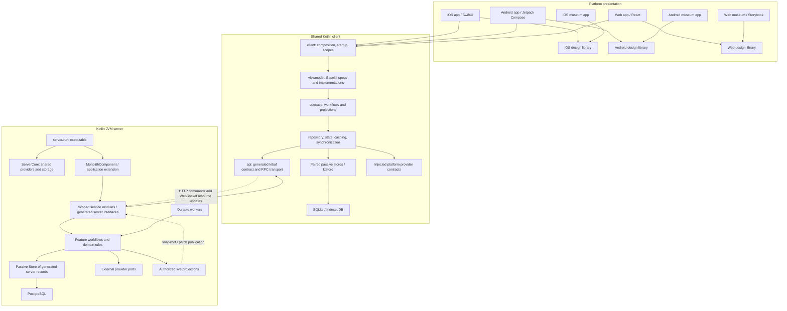

# Basekit end-to-end multiplatform architecture

This is the prescribed reference architecture for a complete Basekit application:
shared Kotlin application logic, native platform presentation, a generated ktbuf
API contract, repository-owned ktstore persistence, DeltaList collections, and a
Kotlin server. It is a prototype architecture specification, not a runnable starter
or a claim that Basekit generates every layer.

The client uses strict MVVM, repository/store pairs, use cases, explicit lifecycle
ownership, design libraries, museums and layered tests. Client and server persist
generated protobuf records in typed ktstore stores and share a generated API. The
server uses scoped service modules, `ServerCore`, extension composition and separate
run/test projects. Product-specific features, deployment identities and OS minimums
belong to the application.

Every ID is a concrete ID class throughout this architecture. Raw strings and byte
arrays are never substitutes for IDs in application contracts, records or queries.

## Implementation guides

| Guide | Implementation detail |
| --- | --- |
| [IDs and semantic types](guides/ids.md) | Canonical wrappers, protobuf fields, equality, immutability, adapters and enforcement |
| [Protobuf storage and repositories](guides/storage-and-repositories.md) | Generated records, typed stores/indexes, cache ownership, commits, migrations and lifecycle |
| [DeltaList collections and child viewmodels](guides/delta-lists.md) | Deep collection recipes, search, feedback children, composition, sections, paging, leases and bindings |
| [Testing applications end to end](guides/testing.md) | Layered tests, full listening-server startup, independent clients, real viewmodel journeys and durable process restart |
| [Platform providers and dependency injection](guides/platform-providers.md) | Typed capability contracts, layered injection, native/browser defaults, session modes and presentation ownership |
| [Child viewmodels, identity and ownership](guides/child-viewmodels.md) | Stable children, retained row registries, drafts, scoped actions, binding leases and disposal |
| [Typed navigation, results and platform hosts](guides/navigation.md) | Declared edges, typed arguments, responding destinations, guards, deep links, history and restoration |
| [Client composition, startup and lifecycle](guides/composition-startup-and-lifecycle.md) | Layered factories, scope ownership, session/root resolution, acknowledgement, account transitions, headless work and shutdown |
| [Use cases and mutation workflows](guides/use-cases-and-mutation-workflows.md) | Whole-flow reuse, cohesive operation groupings, concurrency, optimistic overlays, partial outcomes and reconciliation |

## Architecture schema



Solid arrows describe dependencies or ownership; dotted arrows describe network
delivery or publication. Results and observations travel back through contracts. There is no
client-to-server module dependency. Client repositories and server services consume
the generated public contract in `:api`; server-only storage messages stay in `:server`.

The five client application modules are strictly:

```text
:client → :viewmodel → :usecase → :repository → :api
                                     └── owns passive stores → ktstore
```

`:api` owns public protobuf models, canonical shared semantic types, generated
services and the client transport boundary. Public types may be exposed upward
where signatures require them; feature code still follows the five-layer chain.
Client persistence schemas are generated in `:repository`; server persistence
schemas are generated in `:server`. No extra `:protocol` or `:types` module is
required. Platform apps consume the curated `:client` facade and their design library.

## Stack and ownership

| Part | Prescription | Application responsibility |
| --- | --- | --- |
| Application logic | Kotlin Multiplatform and coroutines | Domain state, commands, policies and lifecycle |
| Presentation logic | Basekit viewmodel and navigation slices | Handwritten implementations, immutable state, typed destinations and actions |
| Observable collections | DeltaList; SectionedDeltaList where needed | Stable identity, valid collector history and child ownership |
| Persistence | Protobuf-generated records in ktstore on client and server | `Store<Record>`, generated byte codecs, explicit indexes and migrations |
| API contracts | `.proto` + `protoc` + `protoc-gen-kt` + ktbuf | Feature contracts, semantic mappings and compatibility policy |
| Client networking | Generated ktbuf RPC clients over injected `RpcClient` / `HttpRpcClient` | Session integration, cancellation, recovery and lifecycle |
| Server | Kotlin/JVM, Ktor, ktbuf, kotlin-inject service modules and extensions | `ServerCore`, feature services, monolith composition and run/test hosts |
| Authoritative persistence | ktstore PostgreSQL delegate behind typed protobuf stores | Transactions, migrations, concurrency and durable receipts |
| Native presentation | SwiftUI on iOS; Jetpack Compose on Android | Platform navigation, providers, UI execution and native design components |
| Web presentation | React with generated Basekit bindings | Browser routing, providers and a canonical component library |
| Design review | Standalone native museums; React Storybook | Deterministic catalog, component states and accessibility coverage |

Basekit generates navigation, bindings and DI integration from declarations. It does
not generate business workflows, cache policy, stores, server authorization or a
design system. Ktbuf supplies serialization and RPC building blocks. Ktstore
supplies persistence. DeltaList supplies the local incremental collection contract.

## Module contracts and permitted dependencies

| Module | Owns | Feature code may call |
| --- | --- | --- |
| `:client` | Production graph, provider injection, application/account scopes, startup, headless entry points, exported bindings | Module-owned construction/lifecycle factories; exported viewmodel coordination |
| `:viewmodel` | Basekit specs and implementations, scalar state, drafts, actions, row children, typed navigation | Use cases and generated scoped navigators |
| `:usecase` | Application commands, cross-repository workflows, reusable observation projections | Repository interfaces |
| `:repository` | Domain observations, cache/read-through, synchronization, freshness, materialized projections | Typed API facade, paired stores, platform provider interfaces |
| `:api` | Generated protobuf models, canonical semantic types, service clients/server interfaces/descriptors, transport integration | ktbuf runtime and injected RPC transport/session capabilities |

Use `implementation` project dependencies by default. Use `api` and framework/JS
exports only where a public signature needs them. Construction factories assemble
downward and hide concrete lower-layer implementations. Exporting a type to Swift
or TypeScript does not authorize a view to construct its repository.

Enforce these boundaries in builds and import checks:

- Views render Basekit state/children and invoke generated actions. They do not
  fetch domain data, create a second domain cache or resolve business eligibility.
- Viewmodels call use cases for commands and observations. Navigation stays here;
  use cases do not import screen classes or platform routes.
- Use cases do not call stores, SQL, generated RPC clients or platform SDKs.
- Repositories do not import viewmodels, navigation or platform UI objects.
- Stores never observe networks, emit content changes or call repositories.
- Client code never depends on server implementation or server-storage modules.
- Design depends on neither app nor museum; product apps do not depend on fixtures.
- Every identifier in every layer uses its canonical ID class. Raw `String` and
  `ByteArray` identifier signatures, fields, collection keys and query arguments
  fail architecture checks, including in generated contracts and test fixtures.

Organize every module by feature. A feature spans the layers; an HTTP endpoint is
not automatically a repository, use case or screen. Synchronization helpers belong
inside repositories. Cross-feature workflows belong in use cases.

## Complete prototype layout

Paths below define build ownership; filenames illustrate application-owned code.
They are not existing Basekit APIs. App/design/museum must be independent targets
or packages, not merely directories inside one application.

```text
application/
├── proto/                               # Canonical public contract
│   ├── common/v1/model.proto            # Canonical shared IDs and values
│   └── items/v1/
│       ├── model.proto                  # Public domain messages
│       └── items_service.proto          # Requests, responses and service methods
├── project/                             # Gradle project root
│   ├── settings.gradle.kts
│   ├── build.gradle.kts
│   ├── gradle/libs.versions.toml
│   ├── api/                             # :api, generated public ktbuf contract
│   │   ├── src/commonMain/.../transport/ # RPC adapter/session integration
│   │   └── build/generated/             # Generated models, codecs and services
│   ├── client/                          # :client, platform integration facade
│   │   └── src/commonMain/.../
│   │       ├── ApplicationClient.kt
│   │       ├── ClientProviders.kt
│   │       ├── composition/
│   │       ├── lifecycle/
│   │       ├── startup/
│   │       ├── navigation/
│   │       └── background/
│   ├── viewmodel/                       # :viewmodel, Basekit specs + implementations
│   │   ├── src/commonMain/.../items/
│   │   │   ├── ItemsViewModel.kt
│   │   │   ├── RealItemsViewModel.kt
│   │   │   └── ItemRowViewModel.kt
│   │   └── build/generated/             # Basekit Kotlin/Swift/React bindings
│   ├── usecase/                         # :usecase, feature workflows/projections
│   │   └── src/commonMain/.../items/
│   │       ├── ObserveItemsUseCase.kt
│   │       ├── RefreshItemsUseCase.kt
│   │       └── RenameItemUseCase.kt
│   ├── repository/                      # :repository, reactive ownership + stores
│   │   ├── src/main/proto/storage/v1/
│   │   │   └── client_storage.proto     # LocalItem, pages, checkpoints; ktbuf generated
│   │   ├── src/commonMain/.../
│   │   │   ├── repository/items/        # Interface, implementation, synchronization
│   │   │   ├── store/items/
│   │   │   │   ├── ItemStore.kt          # Typed passive interface
│   │   │   │   └── ItemStoreImpl.kt      # Store<LocalItem> + generated byte codecs
│   │   │   ├── store/database/          # ktstore configuration and migrations
│   │   │   ├── provider/                # Shared platform capability contracts
│   │   │   └── projections/
│   │   └── build/generated/             # Client-storage protobuf Kotlin
│   ├── server/                          # :server, reusable JVM server library
│   │   ├── src/main/proto/storage/
│   │   │   └── server_storage.proto     # ServerItem, receipts, outbox records
│   │   ├── src/main/kotlin/.../server/
│   │   │   ├── ServerCore.kt            # Scoped kotlin-inject graph and setup
│   │   │   ├── MonolithComponent.kt     # Services/extensions and start/stop
│   │   │   ├── ApplicationExtension.kt  # Application service contribution
│   │   │   ├── services/items/v1/
│   │   │   │   ├── ItemsServiceModule.kt # GrpcRouteProvider<ItemsServer>
│   │   │   │   ├── ItemsServiceImpl.kt   # Generated server interface implementation
│   │   │   │   ├── ItemStore.kt          # Typed passive server store interface
│   │   │   │   └── ItemStoreImpl.kt      # Store<ServerItem>, injected delegate
│   │   │   ├── domain/                  # Extracted rules/workflows where needed
│   │   │   ├── workers/
│   │   │   └── tools/                   # Scopes, context, telemetry, route helpers
│   │   ├── build/generated/             # Server-storage protobuf Kotlin
│   │   ├── run/                         # :server:run, executable composition
│   │   │   └── src/main/.../Main.kt      # Durable delegate, setup, Ktor, shutdown
│   │   └── test/                        # :server:test, real service/transport harness
│   ├── ios/                             # SwiftUI: independent app/design/museum targets
│   │   ├── app/
│   │   ├── design/
│   │   └── museum/
│   ├── android/                         # Compose: independent app/design/museum modules
│   │   ├── app/
│   │   ├── design/
│   │   └── museum/
│   ├── web/                             # React: independent app/design/museum packages
│   │   ├── app/
│   │   ├── design/
│   │   └── museum/                      # Storybook and deterministic fixtures
│   ├── test-support/                    # Test-only fakes and deterministic controls
│   └── integration-tests/               # Production client graph against real server
├── localization/                        # Canonical catalog and typed arguments
├── tooling/                             # Generation, compatibility, boundary checks
├── docs/                                # Feature contracts and decisions
└── .github/workflows/                   # Shared/server/browser/Android/Apple lanes
```

Declare actual common, JS browser, Android, Apple device/simulator and JVM test
targets. Add engine/storage implementations to the appropriate platform source
sets. A directory named `jvmTest` does not create a JVM target. The server builds
as a JVM service; the shared client is exported as an Apple framework, Android
artifact and Kotlin/JS package with generated TypeScript bindings.

## Semantic types and model boundaries

**Mandatory rule: every ID always uses a concrete nominal ID class.** This applies
to client and server APIs, protobuf fields, persisted records, repository/store
interfaces, use cases, viewmodels, navigation arguments, platform bindings,
providers, events, operation receipts, collection keys and test fixtures. An
`ItemId` is never a `String` or `ByteArray` argument, and neither is an `AccountId`,
`RoomId`, `ProfileId`, `OperationId`, `SubscriptionId` or provider resource ID.
Do not use aliases, generic untyped IDs, primitive IDs or a second ID class for
the same identity. Different identity domains have different concrete classes.

Serialization requires a scalar representation, but it remains an implementation
detail of the ID wrapper and its codec. Only the serialization/storage/platform
adapter may encode or decode it, and the adapter exposes an ID class to application
code. Never pass unwrapped values between layers, accept them as a convenience
overload, retain them as ID fields or use them as application map/set keys. An
encoded route segment or database key does not become an alternative ID contract.
Plain strings remain appropriate for unstructured text; ordinary byte payloads
remain bytes when they do not represent identity.

Cursors, tokens, revisions, keys and structured values likewise use canonical
concrete named types. Platform-exported values need concrete bridgeable classes;
verify value classes against Basekit's Apple export restrictions before choosing
them. Platform limitations do not permit replacing an ID with a string.

There are four separate model responsibilities:

| Model | Owner | Purpose |
| --- | --- | --- |
| Public protobuf model | `:api` | Canonical values and versioned protobuf interchange |
| Domain value/projection | Repository or canonical shared types | Validated meaning, identity, coverage and eligibility |
| Generated storage message | `:repository` or `:server` storage schemas | Persisted format, indexes, account namespace and migration version |
| Viewmodel state/child | `:viewmodel` | Immutable presentation values, drafts, actions and stable row identity |

Use generated nominal messages such as `ItemId { bytes raw_value = 1; }` as the
canonical identity. Every containing
message uses `ItemId item_id`, never `bytes item_id` or `string item_id`. The
wrapper's scalar field is its serialization representation, not permission to
unwrap identity in application code. Restrict access to that representation to
codecs/adapters and enforce that restriction with static checks.
Do not generate that ID and then create another handwritten ID with the same
meaning. Client/server storage wrappers import the canonical public ID. Local-only
keys remain in their owning storage contract. Validate required message values at
boundaries; proto3 defaults and nullable generated fields do not establish validity.

ID equality and hashing must compare the identity value, including byte contents,
not wrapper reference identity or array identity. Verify generated implementations;
provide a tested canonical implementation if the generator does not satisfy this
contract. IDs must remain immutable after insertion into a map/set or use as a
DeltaList key. Protect byte-backed identities from mutable-array aliasing.

Public protobuf domain messages may be reused or embedded in stored wrappers when
their semantics match. Local/server wrappers add cache, query or authoritative
metadata; RPC envelopes do not become the storage format by accident. Keep
viewmodel state handwritten and presentation-specific. Unknown payloads get an
explicit unsupported or historical representation, rather than an editable kind.

## ktbuf contract and API system

Feature-owned `.proto` files are the single public contract consumed by client and
server. Generate ktbuf messages, codecs, service clients, server interfaces and
descriptors into `:api`.
Keep authentication/concurrency metadata beside the feature contract
with validation against generated methods. Do not maintain a second independent
set of endpoint schemas.

```text
Feature .proto + validated method policy
  → pinned protoc / protoc-gen-kt
  → :api generated ktbuf models / service contracts
  → client repository consumes generated service through injected RpcClient
  → server authenticated handler + generated descriptor
```

The ktbuf server routes unary protobuf requests over HTTP POST and
streaming requests over WebSockets at `/api/<package>.<service>/<method>`. Treat
this as ktbuf's HTTP/WebSocket RPC transport. Do not assume standard HTTP/2 gRPC
or gRPC-Web interoperability from the RPC naming.

The default prescription keeps commands and page/detail queries unary. One
account-owned realtime owner shares subscriptions and transport.
For application-owned live resources, define subscribe/unsubscribe, snapshot,
patch, acknowledgement, resync and typed failure envelopes in that service. This
protocol is application code. If a synchronization library already owns a resource,
use its connector/session/subscription contract instead of duplicating the protocol.

Construct generated clients such as `ItemsServiceRpc(rpcClient)` with an injected
ktbuf `RpcClient`. The default transport is ktbuf's `HttpRpcClient`,
wrapped as needed for tracing, session integration and bounded retry policy. Verify
URL normalization and target-specific cancellation, session and buffering behavior.
A Ktor-backed `RpcClient` remains an implementation option when required by the
application; writing a replacement transport is not a prerequisite for this layout.
Ktor hosts the server routes. A synchronization library's connector owns its
resource transport when that capability is adopted.

HTTP and stream failures must preserve unauthenticated, forbidden, validation,
conflict, unavailable and unknown-outcome distinctions. Bound payloads, buffers and
timeouts. Retry safe reads with limits and jitter. Retry a mutation only under an
explicit server idempotency contract using the same operation identity.

Schema evolution reserves deleted field numbers/names and adds compatible fields.
Specify absent/default/clear semantics explicitly; a scalar default is not proof a
caller supplied it. Test old/new readers, unknown fields/enums, unions and numeric
precision on every supported target. Protocol guidance: [protobuf evolution and
field presence](https://protobuf.dev/programming-guides/proto3/).

### ktbuf integration gates

Verify the pinned runtime and generator against these integration requirements:

- Prove support for every schema feature used, especially maps and explicit proto3
  presence. Where unsupported, use repeated entry messages and tested message/oneof
  presence encodings, or upgrade the generator before adopting the feature.
- Compile and round-trip every RPC shape used. Keep the prototype to unary,
  server-streaming and bidirectional methods; add client-streaming with unary
  response only after generated consumer and route compatibility are proven.
- Verify that all route registration paths forward authenticated request context,
  including unary methods registered through `serveAll`. Register explicitly or
  correct the adapter if that context is lost.
- Own production Ktor composition, origin policy, sanitized errors and
  authentication for both unary and streaming handlers.

Pin runtime, generator and protoc separately. Deterministically generate, remove
stale outputs and compile generated consumers. A generated source file is not proof
of compatible transport, authentication or application behavior.

## Repository/store pairs and local persistence

Every persisted feature has a repository and one or more paired passive stores.
One repository can own entity, query-membership and checkpoint stores. An explicitly
coordinated transaction may span pairs. A stateless capability need not invent a
store simply to satisfy a naming pattern.

The repository owns:

- Typed scalar observations and DeltaList domain collections.
- Memory retention, read-through hydration and deduplicated loads/subscriptions.
- Freshness, errors, query coverage, pagination, ordering and invalidation.
- API/provider calls, synchronization and optimistic overlays where selected.
- Updating memory and publishing coherent observations after committed writes.

The store owns typed suspend reads/writes, generated protobuf records, explicit
indexes and transactions. It exposes no reactive queries, observers or content
notifications. The prescribed persistence format is ktbuf protobuf bytes, on both
client and server. Use generated `LocalItem` / `ServerItem` wrappers and their
`toByteArray` / `fromByteArray` codecs directly in `Store<Record>`; do not create a
parallel handwritten serializable record or a JSON persistence path. Storage
wrappers may embed public generated messages while adding local/server metadata.
They evolve independently of RPC request/response envelopes.

### Protobuf storage pattern

The client storage schema imports canonical public values. A server storage schema
does the same but defines its own `ServerItem` and server-only receipt/outbox records.
The following application-owned example illustrates the pattern; it is not a
compiled starter or a new ktstore API.

```protobuf
syntax = "proto3";
package example.client.storage.v1;
import "items/v1/model.proto";

message LocalItem {
  example.items.v1.ItemId item_id = 1;
  example.items.v1.Item item = 2;
  int64 cached_at_millis = 3;
}
```

```kotlin
// Imports omitted: generated LocalItem/ItemId and their ktbuf codecs,
// plus ktstore Store, StoreDelegate, IndexName, StorageCodec and StoreKey.
interface ItemStore {
    suspend fun get(itemId: ItemId): LocalItem?
    suspend fun put(record: LocalItem)
    suspend fun remove(itemId: ItemId)
}

class ItemStoreImpl(delegate: StoreDelegate) : ItemStore, Store<LocalItem>(
    delegate,
    "local_items",
    LocalItem::toByteArray,
    LocalItem.Companion::fromByteArray,
) {
    private val itemIdKey = mappedIndex(
        IndexName("item_id"), LocalItem::itemId,
        object : StorageCodec<ItemId?, ByteArray> {
            override fun encode(value: ItemId?) = requireNotNull(value).toByteArray()
            override fun key(name: IndexName) = StoreKey.SerializedKey(name.value)
        },
    ).also { primaryKey(it) }

    override suspend fun get(itemId: ItemId): LocalItem? = get(itemIdKey.eq(itemId))
    override suspend fun put(record: LocalItem) = save(record)
    override suspend fun remove(itemId: ItemId) = delete(itemIdKey.eq(itemId))
}
```

The store interface and `eq(itemId)` accept the ID class. The codec's `ByteArray`
is the storage representation internal to that adapter, never a caller-supplied ID.
Use typed mapped indexes for IDs and explicit composite indexes for scoped identity,
for example room ID, keyspace and item ID. All application-facing composite-key
components remain wrapped IDs. Choose and preserve one encoding per index. Encoding
a wrapper's scalar bytes and encoding the complete ID message produce different
representations; changing between them requires migration. Generated records carry
data; repositories/services own validation and observations.

Use account-scoped client storage, or declare account identity in a composite key.
Register/prepare all stores before creating/opening storage. A `StoreDelegate`
implementation uses `prepare()` and `createStores()`; configured ktstore database
handles and migration scopes can supply transactional initialization while retaining
the generated-record/typed-store structure. Client and server choose their own
storage namespaces and persistence lifetimes.

Generate private client storage in the repository module and private server storage
in the server module. Module-local generation keeps server-only records out of
client exports and prevents storage schemas from becoming public RPC responses.

The canonical update sequence is:

```text
Validate remote result, account generation and resource revision
  → atomically persist records + query membership + baseline/checkpoint
  → await successful outer commit
  → update repository memory
  → publish scalar state / DeltaList content
  → use case projection → viewmodel children → native bindings
```

Do not hold network/provider calls inside database transactions. On failure retain
the previous committed content and surface failure; optimistic state is a separate
pending overlay. If cancellation races commit, reconcile using an operation identity
rather than assuming rollback. Concurrent disk reads must not overwrite newer
accepted data. Account generations fence all late completions.

For local atomic work spanning repositories, expose a repository-level unit of work
with declared participants and coordinated publication. Use cases never receive
raw store handles. Separate remote requests remain separate effects; a local
transaction does not make them atomic.

The default product policy is cached offline reads and online writes. Uncached or
incompletely cached data is unavailable/incomplete, not successfully empty. Failed
writes are not queued for later execution. Unknown outcomes support receipt lookup
and reconciliation, not automatic new commands. Applications that need offline
commands must separately specify conflict resolution and replay semantics.

Persist query dimensions, membership, ordering, continuation and coverage, not just
entities. Choose explicit byte/count/age budgets. Eviction invalidates dependent
coverage and checkpoints or triggers resynchronization. Database schema version,
stored-record version and remote resource revision are independent.

## Realtime synchronization and DeltaList

Resource patches on the wire and DeltaList changes in memory are different
contracts. Never send child viewmodels or UI mutation coordinates as server data.

Every resource envelope includes typed subscription identity, resource key, version
generation and revision. Patches specify their exact base and resulting version.
Persist accepted content and its baseline together; acknowledge after acceptance.
Duplicate messages are harmless. A gap, wrong base, expired resume position or
server restart requests an authoritative snapshot. Establish live tracking before
a bootstrap read and reconcile their versions to close the initial-read race.

One account realtime owner shares the connection and reference-counts subscriptions.
Rows do not open sockets. Resume/foreground/manual refresh reconcile resources;
disconnection preserves cached content. Live UI notifications may be best effort
provided current-state recovery is guaranteed. Durable business events and push
delivery use separate server receipts/outbox processing.

All observable collections use DeltaList, including static menus, selected chips,
domain observations and viewmodel children. Plain immutable lists remain valid in
wire messages, passive store results, internal snapshots and test expectations.
Scalar metadata belongs in state; collections belong in their list streams.

At the Basekit spec boundary declare `Flow<Delta<Child>>` with `@ViewModelList`
and enumerate the exact closed child types. Loading, empty, error, header and
content presentations are real children. `@ChildViewModel` is stable and non-null;
use a destination or zero/one delta list for switching children. Basekit's generated
lists are flat; true sticky sections need an explicit tested sectioned adapter.

Every collector receives a valid initial reload and subsequent history relative to
its own preceding snapshot. Prefer immutable snapshots diffed per collector with
`asDeltaList { it.key }`. Do not conflate precomputed mutations or assume mutable
holders provide a lossless edit log. Invalid/skipped coordinates reload from the
authoritative snapshot. Apply mutation batches in their sequential coordinates.
Compatible mutable holders normalize initial delivery and missed publications to
Reload; consecutive publications can retain mutations. Composition must preserve
lazy-item acquisition/release. The [DeltaList guide](guides/delta-lists.md) specifies
those contracts and the consumer verification they require.

Children with retained state use a destination-owned registry keyed by typed
presentation identity. Domain identity and row identity differ when one entity
appears in multiple groups. Lazy mapping is not an identity registry or a disposal
mechanism. Retire removed children, cancel their jobs and release all children when
the destination closes. Test bridge keys and wrapper retention on each platform.

The [child-viewmodel guide](guides/child-viewmodels.md) specifies composition,
draft ownership, registry retention and the distinction between binding and child
lifetimes.

## MVVM, navigation and injected providers

Viewmodels expose immutable scalar state, typed children and actions. They own
drafts, validation feedback, selection and pending-action eligibility. Reusable use
cases own application decisions and cross-repository orchestration. Repositories
own content truth. The server independently validates all authoritative decisions.

Reuse complete workflows through use cases rather than rebuilding their steps in
each caller. One use case may contain several related logical groupings of
observations, commands and flows; one class per operation is not required. The
[use-case and mutation-workflow guide](guides/use-cases-and-mutation-workflows.md)
specifies grouping, operation identity, partial success and recovery.

Basekit specs declare typed destinations, arguments, allowed navigation edges and
results. Handwritten viewmodels invoke generated scoped navigators. Platform
adapters present screens, sheets, dialogs, back behavior and browser history.
Result navigation and its coroutine lifetime belong to the requesting destination.
Decode deep links at boundaries, then validate account/access before opening them.

The [navigation guide](guides/navigation.md) details generated edges, typed argument
adapters, result cancellation, leave guards, platform history and restoration.

Host capabilities are shared provider interfaces supplied to `:client`: secure
storage, authentication/passkeys, external navigation, notification delivery,
connectivity and lifecycle as required. Place capability interfaces at their
consuming repository boundary; expose them through the facade. UI host/navigator
callbacks belong at the client/viewmodel boundary. Native SDK objects stay inside
platform implementations.

Provider results distinguish completion, cancellation, unsupported capability and
failure. A provider login proof must be verified by the server before adopting an
application session. Keep proofs and tokens out of viewmodel state and ordinary
stores. Native secrets use platform secure storage; the default browser session
uses HttpOnly cookies with origin/CSRF protections. Browser sockets need a browser-
compatible authenticated handshake; do not assume arbitrary upgrade headers.

The [platform-provider guide](guides/platform-providers.md) specifies the injection
path, platform defaults, session strategies and host/attempt lifecycle contracts.

## Client composition, startup and account lifecycle

The [composition, startup and lifecycle guide](guides/composition-startup-and-lifecycle.md)
details construction, activation, failure recovery and the transition protocols
summarized here.

`:client` is the only product construction entry point. It supplies module-owned
factories, exports curated viewmodel/provider contracts and owns shutdown. Inject
providers, transport configuration, clock and scoped execution dependencies with
explicit ownership. Avoid global service locators and unowned coroutine scopes.

Startup has three responsibilities:

1. Prepare stores/migrations and start app-scoped services.
2. Resolve session and entry through use cases; prepare the appropriate account
   graph and map the result to a typed navigation root.
3. Ask the platform host to install that root; reveal only after acknowledgement.

Resolution distinguishes signed out, authenticated, cached offline reading and
recovery required. Cached identity is not current authorization. Do not mount an
authenticated screen before resolution or use a Boolean token check as policy.
Feature loading can continue after root installation.

Application scope owns reusable infrastructure. Account scope owns session-bound
repositories, caches, use cases and realtime. Destination scope owns viewmodels,
children, collectors and navigation results. Host/scene scope owns presentation
attachment. Warm resume preserves navigation while revalidating resources; it does
not rebuild the graph for each Activity recreation or React remount.

Logout fences the account generation, stops its work, clears protected navigation,
removes account caches/checkpoints and session material, then constructs signed-out
state in process. Coordinate tabs/workers/other handles and reconcile interrupted
cleanup. A later login cannot accept an earlier account's completion. Treat cache
retention, backup exclusion and UI restoration as explicit product policies; the
prototype defaults to one active account and no restoration of drafts/native stacks.

Headless background entry points reuse preparation and use cases through client
factories. They instantiate no screen or navigator and do not start interactive
authentication. A missing session returns a needs-foreground result. Browser worker
exports must initialize without DOM/React and use worker-safe storage/transport.

## Kotlin server prescription

Organize the server as a reusable `:server` library with feature service packages,
`:server:run` for deployment composition,
and `:server:test` for service and transport integration. Keep workflows and domain
rules inside feature packages or extracted internal collaborators. Separate
`:server:application`, `:server:domain` and `:server:repository` projects are not
required by this prescription.

```text
:server:run → :server → :api
:server:test → :server (+ real generated clients and test dependencies)

Main
  → persistent StoreDelegate / database + metrics + external providers
  → ServerCore (kotlin-inject graph, store bindings and setup)
  → feature ServiceModules (scoped GrpcRouteProviders)
  → MonolithComponent / ServerExtension composition
  → Ktor routes + start/stop lifecycle
```

`ServerCore` owns shared storage and provider bindings, telemetry, service-wide
configuration and initialization. Use kotlin-inject `@Component`, `@Provides` and
explicit core/service scopes. A feature's service module exposes its generated
server implementation and descriptor through `GrpcRouteProvider<ItemsServer>`.
Its `@Inject` implementation implements the generated server interface, with typed
stores and provider interfaces injected. Preserve test substitution at those seams.

```kotlin
// Application-owned service registration.
@ServiceScope
@Component
abstract class ItemsServiceModule(@Component val serverCore: ServerCore) :
    GrpcRouteProvider<ItemsServer> {
    abstract val serverImpl: ItemsServiceImpl
    override val server: ItemsServer get() = serverImpl
    override val descriptor: ServerDescriptor = ItemsServer.Descriptor
}

class ApplicationExtension(serverCore: ServerCore) : ServerExtension {
    private val items = createItemsService(serverCore)
    override val services: List<GrpcRouteProvider<*>> = listOf(items)
}
```

The annotations, factory, service implementation and imports must be wired through
the application's kotlin-inject/ktbuf generation. The fragment specifies ownership
and registration; authentication belongs in the configured route/service boundary.

Keep the feature together:

```text
services/items/v1/
  ItemsServiceModule.kt    # scoped component, server + descriptor
  ItemsServiceImpl.kt      # generated ItemsServer implementation
  ItemStore.kt             # typed passive persistence interface
  ItemStoreImpl.kt         # Store<ServerItem>, protobuf bytes + explicit indexes
  RenameItemWorkflow.kt    # optional extracted rule/orchestration collaborator
```

Complex workflows can use internal repositories and unit-of-work collaborators
where they add policy; server operations need not acquire client-style repository
caches or observations.

The executable owns environment parsing, durable delegate/database construction,
core setup, component start, Ktor listeners and shutdown. The library must not choose
a production database or start listening merely because it is imported. Inject the
same intended durable storage owner into core services and explicitly constructed
extensions; never accidentally select a factory's in-memory development fallback
for production records.

### Extensions and library ownership

Use `ServerExtension` to contribute `services`, raw HTTP `install(routing)` hooks,
background `start()` and resource `stop()` behavior. `MonolithComponent` composes
built-in service modules and installed extensions. An application extension groups
its business services; reusable feature extensions contribute capabilities such as
login or remote content. `ServerExtensionFactory` and ServiceLoader are optional
discovery seams; construct extensions explicitly when durable storage or sensitive
provider configuration must be supplied.

Retain ownership boundaries for adopted libraries. Synchronization and identity
libraries own their authority, session, subscription and feature contracts; the
application owns its business services. Extend registered seams instead of copying
implementations. The application composition root preserves the same scoped
service-module, descriptor and lifecycle shape.

### Authoritative behavior

Generated service methods receive typed `GrpcRequestContext` and protobuf requests.
Authenticate, decode/validate, enforce ownership/permissions/allowed transitions and
expected revision, then return a typed response. Never trust an account ID, local
eligibility flag or cached permission from a client. Shared route context and per-
service verification must agree, including unary and streaming calls.

Server stores persist generated `Server*` protobuf records through ktstore with a
PostgreSQL delegate. Application SQL infrastructure is not a second default storage
system. Operational claim/routing tables can use library-owned JDBC adapters
without changing application-record ownership.

Use a verified transactional path for business state, operation receipt, audit and
outbox records that must commit together. A sequence of legacy `Store.save` calls
is not automatically atomic; require backend transaction conformance before
promising it. Commands carry stable operation IDs and expected revisions. Bind
idempotency to actor, operation and canonical request content: repeats return their
known outcome; reusing an ID with different content fails. Publish accepted live
changes only after commit.

External calls run outside database transactions. Effectful work uses durable
claims/receipts, provider idempotency where available, and an explicit uncertain
state when an effect may have occurred. Workers recover under documented rules and
never blindly repeat an unknown effect. Local transactions do not imply exactly-
once external execution.

For library-managed data, use the library's authority, subscription and delivery
contracts. For application-specific resources, authorize subscriptions and recheck
before sending, bound buffers/history, and recover lost continuity with snapshots.
Keep one authority and synchronization owner per resource.
Start with the local monolith composition; multi-node operation must use the
library's configured ownership/discovery/claim mechanisms and verified application
worker semantics rather than merely running a second independent process.

If notifications are enabled, reuse installed push/delivery seams where applicable.
Application-specific durable work still needs receipts/outbox, bounded retries and
recovery. Notification actions invoke the same authorized, revision-checked command
as a screen. Sockets do not provide mobile background push delivery.

Startup prepares storage/migrations and all service dependencies before readiness.
Expose health/readiness, redacted logs, traces and metrics. Shutdown stops intake,
stops extensions/workers and closes owned providers/storage. Ktor supplies
[WebSocket handlers](https://ktor.io/docs/server-websockets.html) and
[authentication infrastructure](https://ktor.io/docs/server-auth.html) beneath the
application's authorization rules.

## Platform design libraries and museums

Each platform has an app, production design library and independent museum.
Share design semantics and behavioral contracts across platforms while implementing
native presentation: SwiftUI, Android Compose and React. Compose Multiplatform is
not part of this reference prescription.

Design owns semantic colors, relative typography, spacing, component metrics,
primitives, entity rows, feedback, reusable compositions and accessibility behavior.
Components accept immutable presentation inputs and callbacks. Rendering them
requires no authentication, database or live server. Keep any viewmodel binding
surface explicit and accessed through the facade.

Use one canonical UI localization catalog with typed keys/arguments and deterministic
generation into web and native resources. Preserve plural, rich-text and fallback
semantics. Shared state carries typed local-message references; platform bindings
resolve them. Server/user text remains data, including immutable historical text.

Museums import the same production design implementations and theme. Maintain a
manifest mapping every component to its supported states and examples. Include
default/disabled/focused/selected/loading/empty/error/pending/completed states,
appearance, text scaling, long labels, accessibility, RTL and compact/expanded
layouts where applicable. Native museums are standalone apps; Storybook is a
separate web package. IDE previews supplement the catalog.

Binding examples use a deterministic test client through the facade, production
DeltaList adapters and fake external boundaries. Test insert/remove/move/reload,
stable row state and disposal. Keep assets/time/randomness fixed. App and museum
build independently; neither design nor product code imports museum-only controls.

## One complete feature: items

This vertical slice is the minimum prototype, not a set of one-file-per-layer
wrappers. Its application contracts are illustrative, not compiled library examples.

| Boundary | Prototype artifact | Contract |
| --- | --- | --- |
| Public API | Generated `Items` service in `:api` | List page, get detail, rename with operation ID/expected revision; subscribe through live service |
| Server service | `ItemsServiceModule` + `ItemsServiceImpl` | Authenticate, decode typed values, invoke command/query, return typed failure/result |
| Server application/domain | Rename item workflow | Enforce owner and revision; save item and receipt transactionally |
| Server persistence | `ItemStoreImpl : Store<ServerItem>` | Authoritative item/query reads, optimistic concurrency and durable writes |
| Client API | Items facade + ktbuf adapter | Expose typed queries/commands and resource envelopes |
| Client repository/store | ItemRepository + `ItemStoreImpl : Store<LocalItem>` | Read-through cache, persisted membership/baseline, shared DeltaList, synchronization |
| Use cases | Observe/refresh/page/rename items | Reusable observations and commands; no transport/navigation knowledge |
| Viewmodels | Items screen, item/editor and status children | Immutable state, draft, actions, typed navigation and stable child identity |
| Client | Factories and account scope | Assemble real graph and export the root/bindings |
| Platform apps | Items list/editor screens | Bind generated state/actions/children and present native navigation |
| Design/museum | Item row/editor + fixtures | Same component implementation in product and deterministic catalog |

Rename follows the full chain:

```mermaid
sequenceDiagram
    participant View as Native/React view
    participant VM as Item editor viewmodel
    participant UC as Rename use case
    participant Repo as Client repository
    participant Store as Passive ktstore store
    participant API as ktbuf / HTTP
    participant Server as Kotlin handler + application
    participant DB as PostgreSQL
    View->>VM: Edit draft; Save action
    VM->>UC: Rename typed item at expected revision
    UC->>Repo: Command with operation identity
    Repo->>API: Generated unary request
    API->>Server: Authenticated command
    Server->>DB: Validate revision; commit item + receipt
    DB-->>Server: Commit
    Server-->>API: Authoritative result / typed failure
    API-->>Repo: Decode semantic result
    Repo->>Store: Atomically save accepted item + affected cache metadata
    Store-->>Repo: Commit
    Repo-->>UC: Publish domain state / collection changes
    UC-->>VM: Observe accepted content; complete action
    VM-->>View: Updated state/children; typed navigation result
```

The server also updates live projections after commit. A response and concurrent
resource update converge by version and identity; neither produces a duplicate
effect. If server success is followed by local persistence failure, retain a typed
reconciliation state and recover the receipt/snapshot. Do not label that command a
server rollback or generate a new operation on retry.

The prototype must demonstrate list → detail/editor → result, text and Boolean
mutators, paging, an empty/loading/error child, a concurrent update, cached cold
launch, logout and a second clean login. All three hosts use the same production
shared graph and generated bindings.

## Build sequence and acceptance gates

| Stage | Deliverable | Completion gate |
| --- | --- | --- |
| 1. Contracts and skeleton | Modules, types, pinned tools, providers and one synthetic probe | Forbidden dependencies fail; JS/Android/Apple consumers compile generated bindings |
| 2. Native shells and design | App/design/museum targets plus localization generation | All product shells and museums run; shared state/action/list round trips work |
| 3. Passive persistence | Real ktstore delegates, codecs and migrations | Save/reopen, rollback, cross-store commit, upgrade and account erasure on actual backends |
| 4. ktbuf and Kotlin server | Generated API/storage contracts, scoped service modules, RPC clients and run/test hosts | Client/server wire round trips; durable PostgreSQL delegate; authenticated service/extension registration |
| 5. Repositories and synchronization | Real-server caches, queries, page membership and live updates | Post-commit publication, version races, gaps, reconnect, late completion and eviction recovery |
| 6. Use cases and viewmodels | Complete items flow and generated navigation | Production graph headless journey; drafts, guards, failures, child identity and result lifetime |
| 7. Platform qualification | Native screens, providers, history/back and optional push | Actual bindings/navigation; foreground/headless cleanup; design and accessibility review |
| 8. Release prototype | Reproducible builds, migrations, diagnostics and deployment/run guide | Clean-checkout CI, real-server journeys, readiness/shutdown and documented recovery |

Fast fixtures establish the structure early; replace external fakes with an isolated
real server for principal journeys. Do not declare the architecture complete solely
because generated sources or three empty shells compile.

Required verification is layered:

- **Contracts:** deterministic generation, backward-compatibility fixtures, ktbuf
  codec round trips and generated compilation for every target. Reject raw-ID
  schema fields/signatures and raw-value access outside adapters; compile-time
  rejection tests prove that strings, byte arrays and another ID class cannot be
  supplied where a specific ID is required. Verify value equality, hashing,
  immutable byte backing and typed map/set/list keys across platform exports.
- **Stores:** protobuf byte round trips and explicit index encoding; actual IndexedDB,
  native SQLite and server PostgreSQL persistence/reopen/migration; verify transactional
  guarantees, passive behavior and account deletion.
- **Repositories:** delayed/failing storage, shared reads, publication after commit,
  query membership, account fences and concurrent response/stream convergence.
- **Use cases/viewmodels:** decisions and partial success, cancellation, typed
  failures, stable children and generated navigation.
- **Client/server journeys:** production DI and generated test navigator, then the
  real protocol/transport/server/database with controlled external providers.
- **Platforms/design:** mount/unmount, row acquisition, Swift actor behavior,
  Android recreation, React remount, browser history, provider returns and museums.
- **Operations:** server restart, lost publication recovery, worker claims,
  migrations, compatibility gates, diagnostics and shutdown.

Use deferred controls, injected clocks/scopes and explicit prepare/launch/ready
barriers rather than sleeps. A fake store must not emit invented notifications.
Enable Basekit's generated test navigator in test configurations; test support must
not become a production dependency. Ktor's [server test engine](https://ktor.io/docs/server-testing.html)
supports handler checks; real-network tests still verify engines, cookies/upgrades
and lifecycle across the actual boundary.

Include formatting/lint, module checks, generation checks and affected builds for
shared code, server, app, design and museum. Pin compatible published artifacts;
keep local paired-library overrides explicit and isolated. Generated source is a
build output and is never the place to fix a processor defect.
